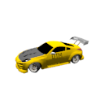
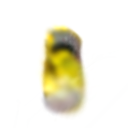
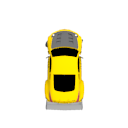
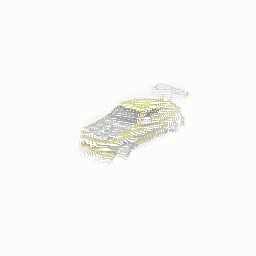

# Enhancing Splatter Image through Front-Back Gaussian Layering

In this project we aim to enhance the **Splatter Image** rendering method by introducing a second splatter image output and incorporating a depth loss during training to separate layers—one in the front and one in the back. This separation aims to improve how Gaussians fit the object, leading to better rendering results.

## Table of Contents

- [Introduction](#introduction)
- [Methodology](#methodology)
  - [Enhancements](#enhancements)
  - [Dataset and Training](#dataset-and-training)
- [Results](#results)
  - [Quantitative Evaluation](#quantitative-evaluation)
  - [Qualitative Evaluation](#qualitative-evaluation)
    - [Render Comparisons](#render-comparisons)
    - [Gaussian Plots Visualization](#gaussian-plots-visualization)
- [Conclusion](#conclusion)
- [References](#references)

## Introduction

The **Splatter Image** technique is a rendering method that leverages point-based rendering with Gaussians to efficiently render scenes. In this project, we aim to enhance this method by:

- Adding a second splatter image to the output.
- Introducing a hinge loss during training to separate the front and back layers.

These enhancements are designed to improve the fitting of Gaussians to objects, resulting in better rendering performance.

## Methodology

### Enhancements

- **Second Splatter Image**: By outputting two splatter images instead of one, we aim to capture more depth information and improve rendering quality.
- **Hinge Loss for Layer Separation**: A hinge loss is added during training to enforce separation between the front and back layers, allowing the Gaussians to fit the object more accurately.

### Dataset and Training

- **Downloading the Codebase** To locally download and work on the code, follow the instructions in the [Original Repository](https://github.com/szymanowiczs/splatter-image)

- **Dataset**: Used 20% of the [SRN-Cars](https://github.com/vsitzmann/scene-representation-networks) dataset due to computational limitations.
- **Training Configuration**:
  - **Steps**: Trained for 20,000 steps.
  - **Batch Size**: 4.
- **Base Model**: Trained the original Splatter Image model under the same configuration for baseline comparison.

#### Loss Graphs

The training loss is comprised of a reconstruction loss and a depth loss:

$$
\mathcal{L}_{\text{total}} = \lambda_{\text{recon}} \mathcal{L}_{\text{recon}} + \lambda_{\text{depth}} \mathcal{L}_{\text{depth}}
$$

Where:
- $\mathcal{L}_{\text{recon}}$ is the mean squared error (MSE) between the original and reconstructed images:

  $$
  \mathcal{L}_{\text{recon}} = \frac{1}{N} \sum_{i=1}^N (\text{original}_i - \text{recon}_i)^2
  $$

  where $N$ is the total number of pixels in the image.

- $\mathcal{L}_{\text{depth}}$ is a hinge loss between the front and back depth maps:

  $$
  \mathcal{L}_{\text{depth}} = \frac{1}{M} \sum_{i=1}^M \max(0, \text{depth}_{\text{front},i} - \text{depth}_{\text{back},i} + \Delta)
  $$

  where $M$ is the number of pixels in the depth maps and $\Delta$ is a margin.

- $\lambda_{\text{recon}}$ and $\lambda_{\text{depth}}$ are weighting factors for the reconstruction and depth losses, respectively.

## Results

### Quantitative Evaluation

We evaluated the performance on novel data using PSNR, SSIM, and LPIPS metrics.

<table>
  <tr>
    <th rowspan="2">Model</th>
    <th colspan="3" style="text-align:center;">Cond</th>
    <th colspan="3" style="text-align:center;">Novel</th>
  </tr>
  <tr>
    <th>PSNR ↑</th>
    <th>SSIM ↑</th>
    <th>LPIPS ↓</th>
    <th>PSNR ↑</th>
    <th>SSIM ↑</th>
    <th>LPIPS ↓</th>
  </tr>
  <tr>
    <td>Baseline</td>
    <td>26.69</td>
    <td>0.937</td>
    <td>0.121</td>
    <td>19.99</td>
    <td>0.846</td>
    <td>0.225</td>
  </tr>
  <tr>
    <td><strong>Ours</strong></td>
    <td><strong>28.56</strong></td>
    <td><strong>0.956</strong></td>
    <td><strong>0.083</strong></td>
    <td><strong>20.23</strong></td>
    <td><strong>0.851</strong></td>
    <td><strong>0.219</strong></td>
  </tr>
</table>

*Table 1: Quantitative comparison between the original and enhanced models.*

### Qualitative Evaluation

#### Render Comparisons

Below are sample renders comparing the original and enhanced models. We can observe that our model preserves the original car shape better than the base model. Especially in the images where the front of the car is shown, the seperation between the front and back gaussians allows the model to give higher quality from the front views compared to the base model where the gaussians would have to find a balance between front and back views, even at such a low steps (20k).

**Red Car**

<table>
  <tr>
    <th style="text-align:center;">Base Model</th>
    <th style="text-align:center;">Our Model</th>
    <th style="text-align:center;">GT</th>
  </tr>
  <tr>
    <td style="text-align:center;"></td>
    <td style="text-align:center;"></td>
    <td style="text-align:center;"></td>
  </tr>
  <tr>
    <td style="text-align:center;"></td>
    <td style="text-align:center;"></td>
    <td style="text-align:center;"></td>
  </tr>
  <tr>
    <td style="text-align:center;"></td>
    <td style="text-align:center;"></td>
    <td style="text-align:center;"></td>
  </tr>
</table>

* We see that the car shape is relatively consistent in both sides of the car.

**Yellow Car**

<table>
  <tr>
    <th style="text-align:center;">Base Model</th>
    <th style="text-align:center;">Our Model</th>
    <th style="text-align:center;">GT</th>
  </tr>
  <tr>
    <td style="text-align:center;"></td>
    <td style="text-align:center;"></td>
    <td style="text-align:center;"></td>
  </tr>
  <tr>
    <td style="text-align:center;"></td>
    <td style="text-align:center;"></td>
    <td style="text-align:center;"></td>
  </tr>
  <tr>
    <td style="text-align:center;"></td>
    <td style="text-align:center;"></td>
    <td style="text-align:center;"></td>
  </tr>
</table>

*Figure 1: Render comparison between the original and enhanced models.*

**360 Comparisons**                                    |

<table>
  <tr>
    <th style="text-align:center;">Base Model</th>
    <th style="text-align:center;">Our Model</th>
    <th style="text-align:center;">GT</th>
  </tr>
  <tr>
    <td style="text-align:center;"></td>
    <td style="text-align:center;"></td>
    <td style="text-align:center;"></td>
  </tr>
    <tr>
    <td style="text-align:center;"></td>
    <td style="text-align:center;"></td>
    <td style="text-align:center;"></td>
  </tr>
    <tr>
    <td style="text-align:center;"></td>
    <td style="text-align:center;"></td>
    <td style="text-align:center;"></td>
  </tr>
  </tr>
    <tr>
    <td style="text-align:center;"></td>
    <td style="text-align:center;"></td>
    <td style="text-align:center;"></td>
  </tr>
</table>

*Figure 2: Render comparison between the original and enhanced models.*

#### Gaussian Plots Visualization

We visualize the separation of Gaussians by plotting them in 3D space. As we can see our model splits the gaussian to front and back layerings to capture the object better.

**Note**: The gaussians shown here are not all of those from splatter image we only showed ones with an opacity that is bigger than a chosen threshold for better visualization. 

**Our Model Gaussians**:

<table>
  <tr>
    <th style="text-align:center;">Front Splatter</th>
    <th style="text-align:center;">Back Splatter</th>
    <th style="text-align:center;">Combined</th>
  </tr>
  <tr>
    <td style="text-align:center;"></td>
    <td style="text-align:center;"></td>
    <td style="text-align:center;"></td>
  </tr>
  <tr>
    <td style="text-align:center;"></td>
    <td style="text-align:center;"></td>
    <td style="text-align:center;"></td>
  </tr>
  <tr>
    <td style="text-align:center;"></td>
    <td style="text-align:center;"></td>
    <td style="text-align:center;"></td>
  </tr>
</table>

**Base Model Gaussians for Comparison**:
<table>
  <tr>
    <td style="text-align:center;"></td>
    <td style="text-align:center;"></td>
    <td style="text-align:center;"></td>
  </tr>
</table>

## Other Experiments

We also experimented with different loss functions like the logistic loss which captured the general shape of the gaussians that the original model puts in the back (see figures below). However, we saw that the range of opacity for each gaussian of the back splatter in this model was between 0.006 - 0.001 where as the front splatter would be between 0.2 - 0.04 (which is also the range we got for both front and back splatter images in the final model)

To address this, we tried to add an opacity loss to the model, we experimented with a smooth l1 loss between the gaussians and a Wasserstein loss between the distribution of the opacity on the gaussians. While the second loss yielded slightly better results, the final model would always underperform in all aspects.

*Figure 3: Comparison between the base model's back gaussians and our logistic back gaussians*

## Conclusion

The enhancements made to the Splatter Image method show promising results both quantitatively and qualitatively. By adding a second splatter image and incorporating a hinge loss for layer separation, we achieved better performance on novel data, as evidenced by improved PSNR, SSIM, and LPIPS scores.

## References

- **Original Paper**: *Kellnhofer, P., Liao, Z., & Sunkavalli, K. (2021). Neural Splatting for Real-Time Rendering of Dynamic Scene Lighting*. [arXiv:2106.13374](https://arxiv.org/abs/2106.13374)
- **SRN-Cars Dataset**: [Scene Representation Networks](https://github.com/vsitzmann/scene-representation-networks)

---

*For more details, please refer to the project repository.*
